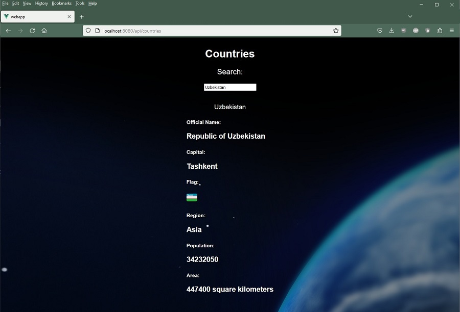
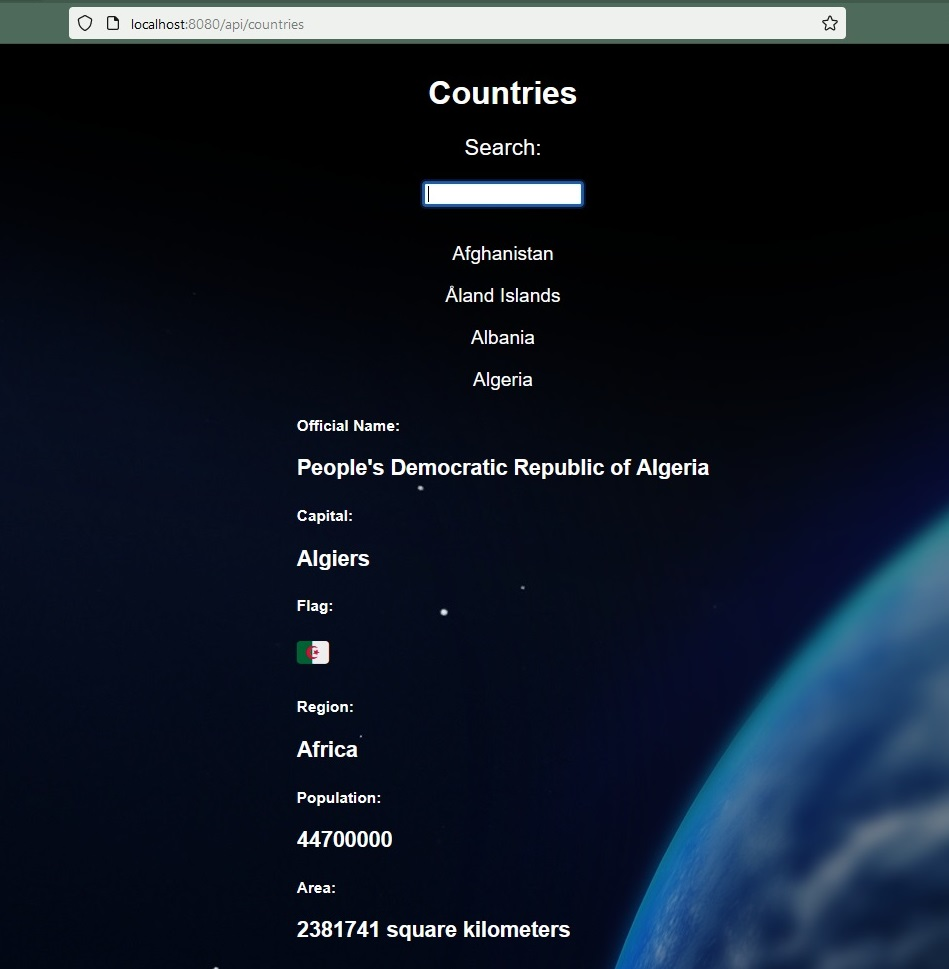

# quarkus-vue-app

This project uses Quarkus, the Supersonic Subatomic Java Framework.

If you want to learn more about Quarkus, please visit its website: https://quarkus.io/ .

## Running the application in dev mode

This web app lists the countries found in the Restcountries Free API at [https://restcountries.com/v3.1/all](https://restcountries.com/v3.1/all)
The user can click each country in the alphabetically sorted list to see a smooth transition open up detailed information of the selected country. With a second click the user can hide the additional information.

The user can also type a name of the country into the search query input field at the top of the page to get a realtime search result on the page.

The application can be started in dev mode with two terminal windows.

First terminal window is navigated to main application folder 

**/quarkus-vue-app**

and this command is used:
```shell script
./mvnw compile quarkus:dev
```
The second terminal window is navigated to the Vue main folder 

**/quarkus-vue-app/src/main/webapp**

and this command is used:
```shell script
npm run serve
```

You can then type this URL to your browser window to view the page
```shell script
http://localhost:8080
```


